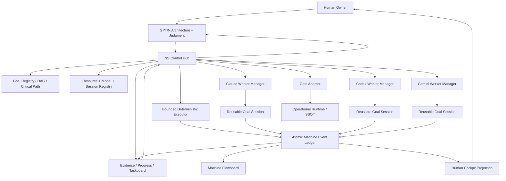
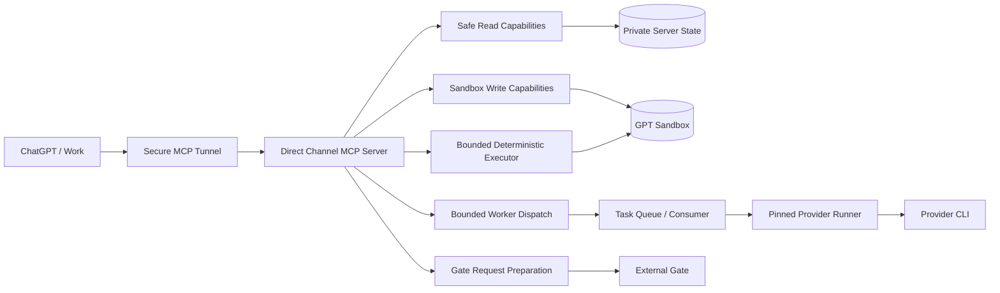
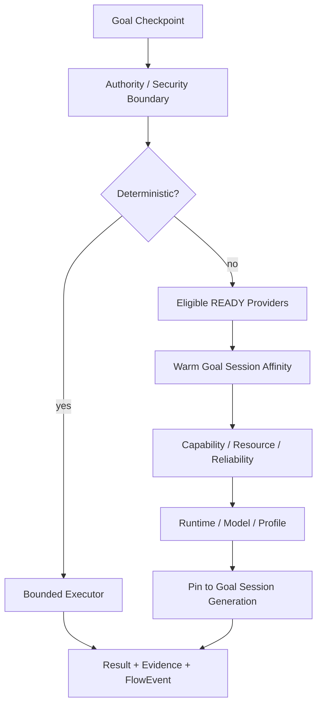
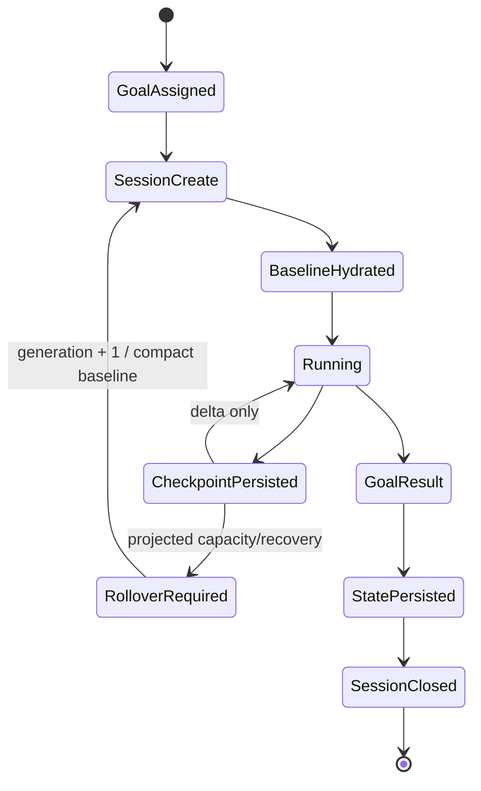
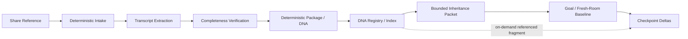
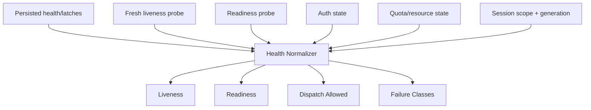
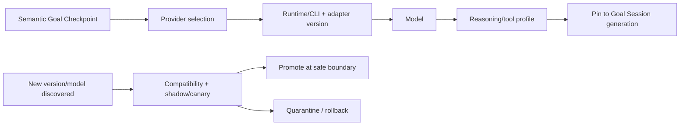
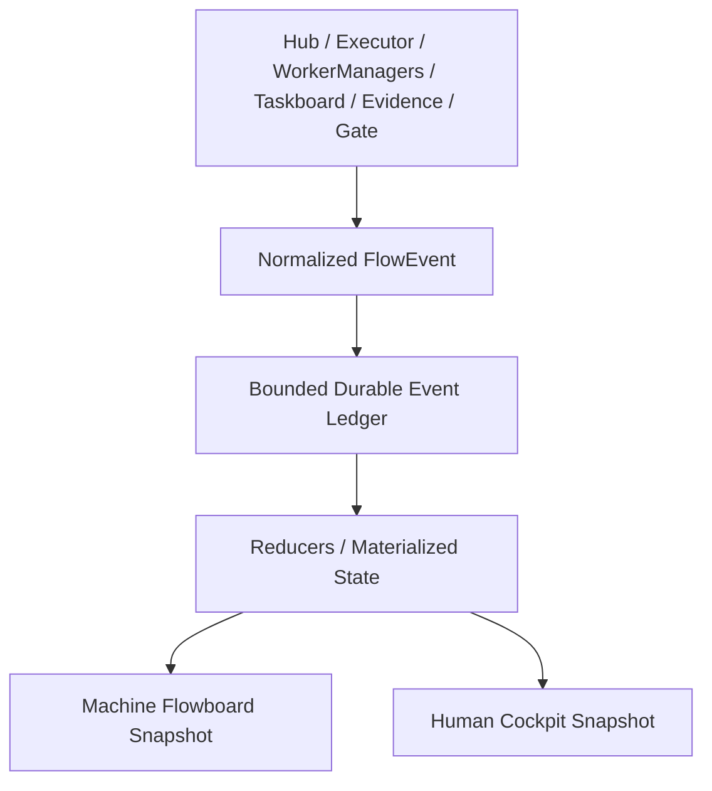
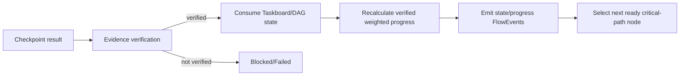
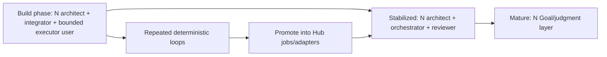

# System Diagrams

## 1. V3 end-to-end control path

## 2. Direct Channel boundary

Rule: executor access is bounded capability, not unrestricted root shell.

## 3. Routing decision

## 4. Goal Session context lifecycle

## 5. Zero-unnecessary-AI DNA path

Default infrastructure path creates no provider session. Optional semantic enrichment is separate.

## 6. Health normalization

Rule: `Liveness != Readiness != Dispatch Allowed`, and health identity includes scope/source/freshness.

## 7. Execution-profile governance

## 8. Atomic event truth and dual projection

Rule: Human Cockpit is a projection, never a second truth collector.

## 9. Evidence-driven progress

## 10. Progressive GPT/N role reduction

